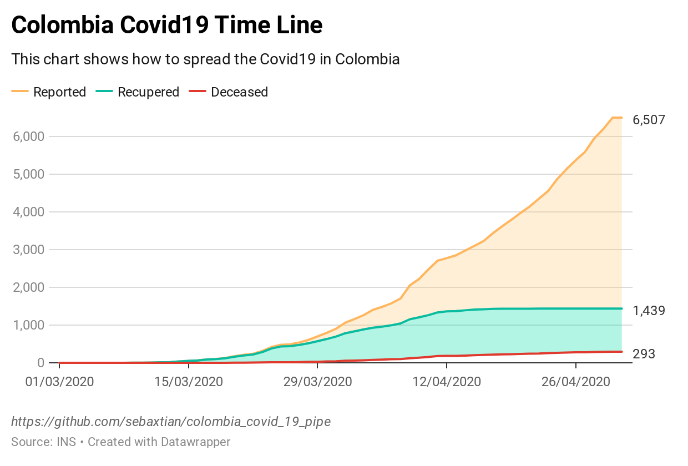

# Colombia Covid19 Pipeline

Pipeline to get data sources from Instituto Nacional de Salud - INS related to Covid19 cases daily report in Colombia to create datasets.

---

[](https://www.datawrapper.de/_/b9YVt/)

---

### Context

The number of new cases is increasing day by day around the world. This dataset has information about reported cases from 32 Colombia departments.

Here you can find the result from my auto-learning process about data science, this dataset has a daily report from Instituto Nacional de Salud - INS about Covid19 cases reported in Colombia, also has a history report from Instituto Nacional de Salud - INS about Covid19 Samples processed in Colombia.

### Content

This dataset uses the INS Covid19 report data source, I did clean the data source and fill the NaN values to generate this dataset with additional attributes like, day of the week, year, and month of the year.

**covid19co.csv** -&gt; Daily report, Cases reported in Colombia
**covid19co_samples_processed.csv** -&gt; Daily report, Samples processed in Colombia

This dataset is updated from an automatic pipeline, you can find the GitHub code repository here: [colombia_covid_19_pipe](https://github.com/sebaxtian/colombia_covid_19_pipe)

### Acknowledgements

Dataset is obtained from Instituto [Nacional de Salud - INS](https://www.ins.gov.co/Noticias/Paginas/Coronavirus.aspx) daily report Covid19 in Colombia.
You can get the official dataset here: [INS - Official Report](https://www.datos.gov.co/Salud-y-Protecci-n-Social/Casos-positivos-de-COVID-19-en-Colombia/gt2j-8ykr)


### Inspiration

What questions do you want to see answered?

You can view and collaborate with the analysis here: [colombia_covid_19_analysis](https://www.kaggle.com/sebaxtian/colombia-covid-19-analysis) Kaggle Notebook Kernel.

---

## Requirements

- **Python 3**:
  - See [requirements.txt](./requirements.txt) file.

## Source Code

See [./src](./src) directory.

## Datasets

See [./output](./output) directory.

## Documentation

| Directory | Readme    |
|-----------|-----------|
| ./chart   | [README.md](./chart/README.md) |
| ./doc     | [README.md](./doc/README.md) |
| ./input   | [README.md](./input/README.md) |
| ./output  | [README.md](./output/README.md) |
| ./src     | [README.md](./src/README.md) |

### How to use

Please read and execute each step below:

#### Step 1

Create and use Python virtual environment:

```bash
$promt> python3 -m venv .venv
$promt> source .venv/bin/activate
```

#### Step 2

Install all Python requirements:

```bash
$promt> pip3 install -r requirements.txt
```

#### Step 3

Run Pipeline script:

```bash
$promt> ./run.sh
```

The Pipeline output is generated within [./output](./output) directory.

#### Step N

> Work in progress ...

---

#### Jupyter Nootebook to Python Script

```bash
$promt> jupyter nbconvert --to script ./src/colombia-covid-19-pipe.ipynb --output colombia_covid_19_pipe
```

---

***That's all for now ...***

---

#### Would you like contribute?

> Getting in touch with [@sebaxtianbach](https://twitter.com/sebaxtianbach)

---

#### License

[MIT License](./LICENSE)

#### About me

[https://about.me/sebaxtian](https://about.me/sebaxtian)
